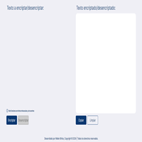

# 🔒 Encriptador de Texto

Una herramienta sencilla para encriptar y desencriptar texto utilizando HTML, CSS y JavaScript.

## 📝 Descripción

Este proyecto es una aplicación web que permite a los usuarios encriptar y desencriptar texto de manera fácil y rápida. La interfaz es responsive y está diseñada para funcionar bien en dispositivos móviles y de escritorio.

## 🌟 Características

- 🔑 Encriptación y desencriptación de texto.
- 📱 Interfaz de usuario responsive.
- ⏳ Indicador de carga (spinner) mientras se procesa el texto.

## 🖼️ Captura de Pantalla



## 💻 Tecnologías Utilizadas

- 
- 
- 

## 🚀 Instalación

1. Clona este repositorio:
    ```bash
    git clone https://github.com/Walter-Britos1/challenge1-alura
    ```

2. Navega al directorio del proyecto:
    ```bash
    cd challenge1-alura
    ```

3. Abre `index.html` en tu navegador web.

## 📚 Uso

1. Ingresa el texto que deseas encriptar o desencriptar en el área de texto correspondiente.
2. Haz clic en el botón "Encriptar" o "Desencriptar".
3. El resultado aparecerá en el área de salida de texto.


## 📬 Contacto

Si tienes alguna pregunta o sugerencia, no dudes en abrir un issue o contactarme a través de [mi email](mailto:walterbritos418@gmail.com).


